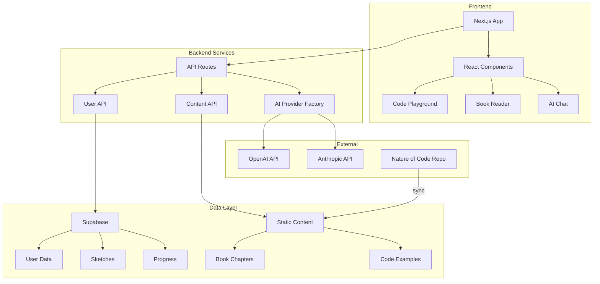

# Architecture Overview

## System Architecture

The Nature of AI platform is built as a monorepo with a clear separation of concerns between different modules.

## Core Components

### 1. Frontend Application (`/app`)
- **Framework**: Next.js 14 with App Router
- **Styling**: Tailwind CSS
- **State Management**: Zustand (planned)
- **Key Features**:
  - Server-side rendering for SEO
  - Client-side interactivity for playground
  - Responsive design for all devices

### 2. AI Integration (`/ai`)
- **Primary SDK**: Vercel AI SDK
- **Providers**: OpenAI, Anthropic, Groq, Ollama
- **Features**:
  - Context-aware chat
  - Code explanation
  - Debug assistance
  - Learning recommendations

### 3. Content Pipeline (`/scripts`)
- **Sync System**: Git submodule updates
- **Processing**: Markdown to JSON conversion
- **Indexing**: Search index generation
- **Caching**: Processed content storage

### 4. Code Playground (`/playground`)
- **Editor**: Monaco Editor
- **Runtime**: p5.js in sandboxed iframe
- **Features**:
  - Live preview
  - Error handling
  - Code persistence
  - Sharing capabilities

## Data Flow

### Content Synchronization
1. Git submodule pull from upstream
2. Markdown parsing and code extraction
3. JSON generation with metadata
4. Search index building
5. Static file generation

### User Interaction Flow
1. User loads chapter
2. Content fetched from static files
3. Code examples rendered in playground
4. AI context prepared from current chapter
5. User can edit, run, and get AI help

### AI Interaction Flow
1. User asks question
2. Current context assembled (chapter, code, error)
3. Request sent to AI provider
4. Streaming response rendered
5. Code suggestions integrated

## Security Considerations

### API Security
- Rate limiting on all endpoints
- API key validation
- CORS configuration
- Input sanitization

### Code Execution
- p5.js runs in sandboxed iframe
- No direct DOM access from user code
- Resource limits enforced
- Output sanitization

### Data Privacy
- User data encrypted at rest
- Secure authentication flow
- Minimal data collection
- GDPR compliance

## Performance Optimization

### Frontend
- Code splitting by route
- Lazy loading of components
- Image optimization
- Service worker caching

### Backend
- Edge functions for API routes
- Efficient database queries
- Response caching
- CDN for static assets

### AI Optimization
- Streaming responses
- Context window management
- Fallback providers
- Request batching

## Scalability Plan

### Horizontal Scaling
- Vercel deployment auto-scales
- Supabase handles database scaling
- CDN for global content delivery
- Multiple AI provider support

### Vertical Scaling
- Optimize bundle sizes
- Implement virtual scrolling
- Database query optimization
- Caching strategies

## Monitoring Strategy

### Application Monitoring
- Error tracking with Sentry
- Performance monitoring
- User analytics
- API usage tracking

### Infrastructure Monitoring
- Uptime monitoring
- Response time tracking
- Resource usage alerts
- Cost monitoring